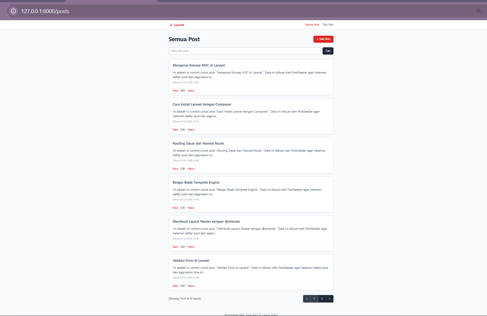
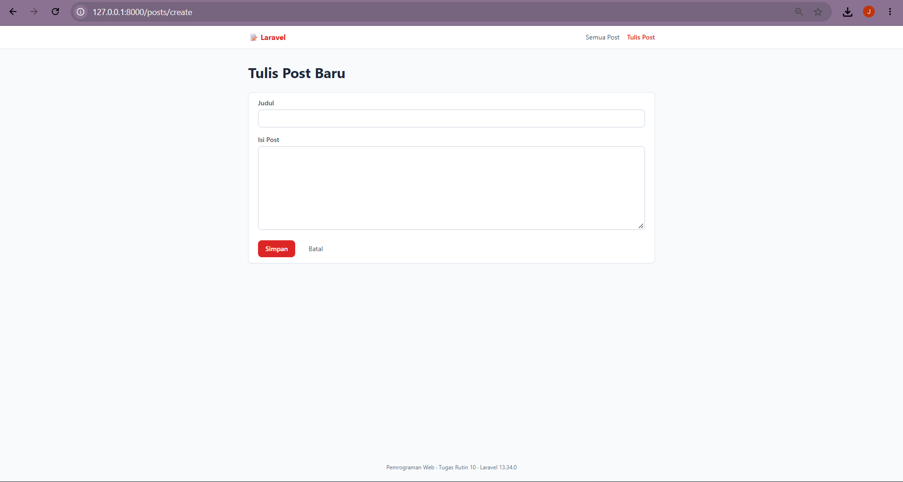
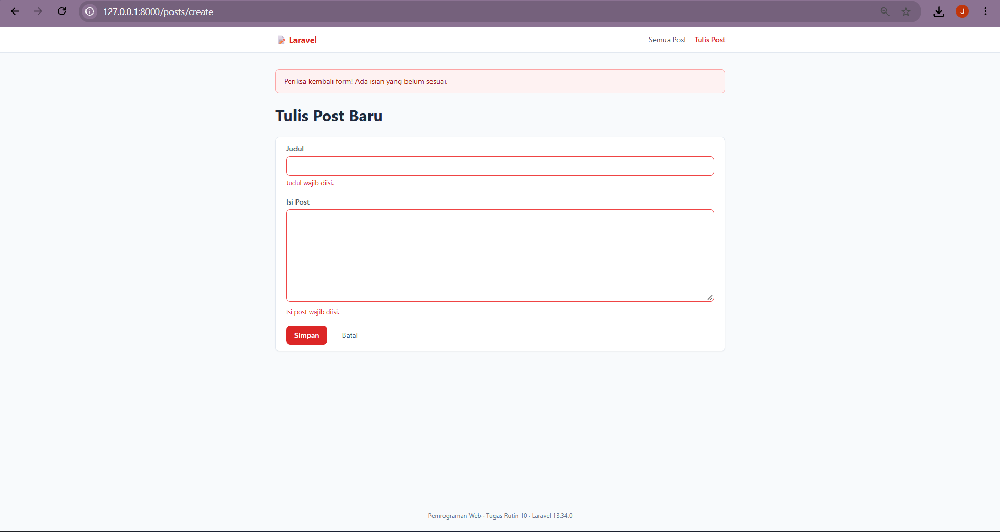
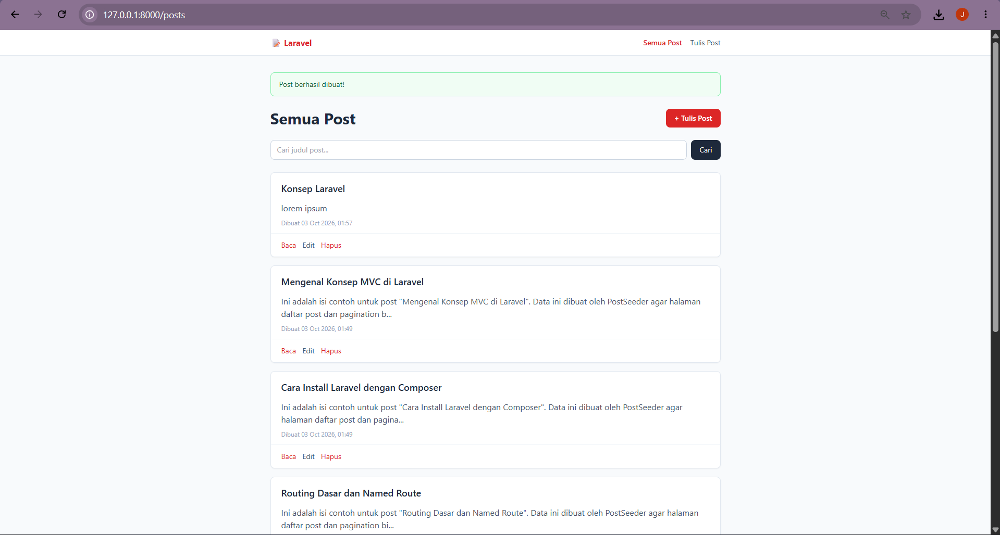
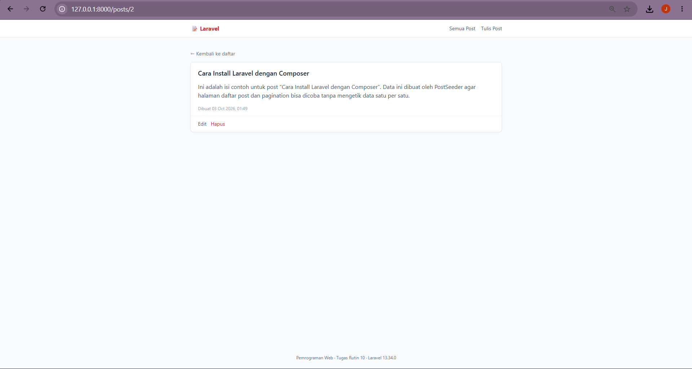
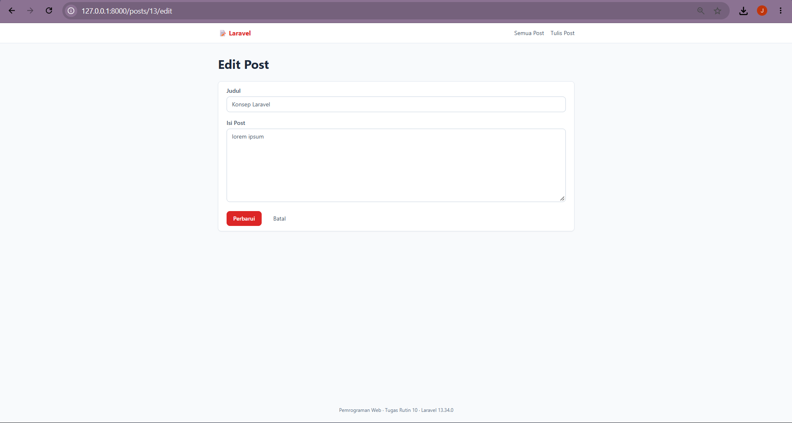
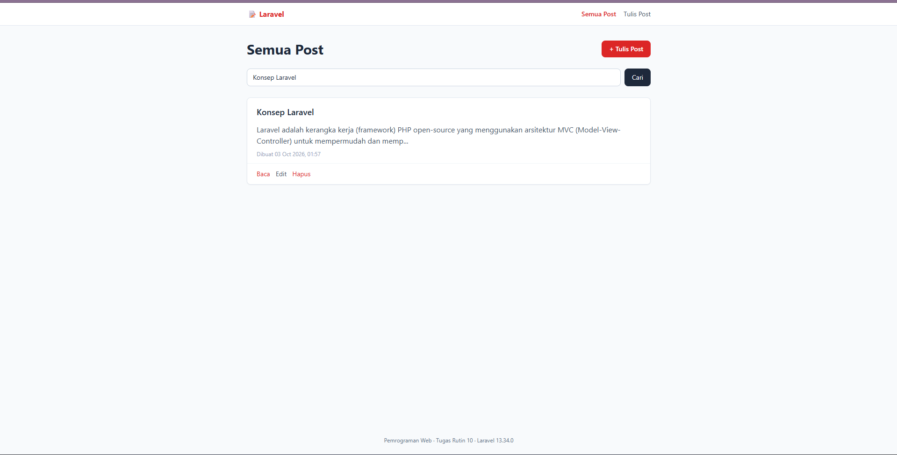
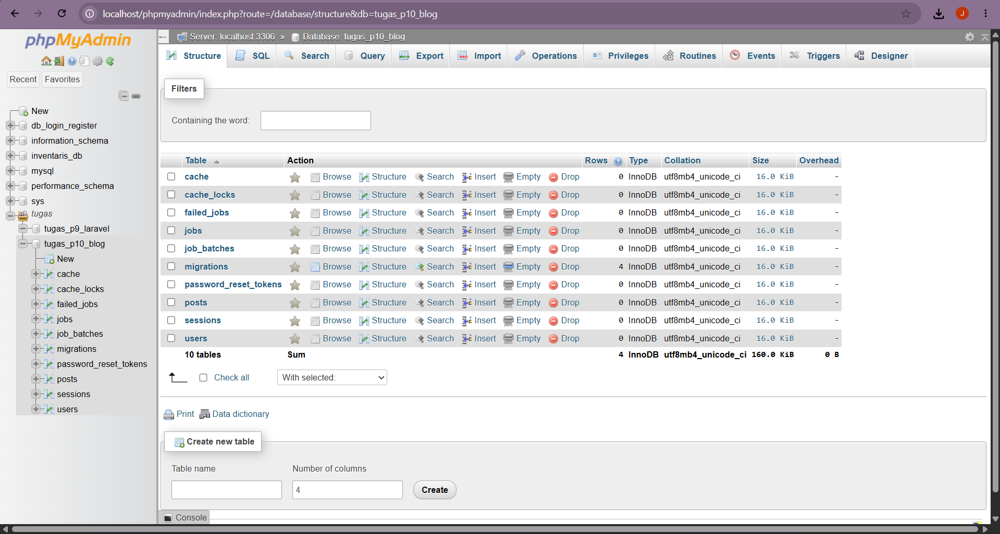

# TugasWeb-P10-BlogCRUD

**Tugas Rutin 10 — Pemrograman Web (3KOM40115)**
Nama: JEFLIE YOFI PUTRA · NIM: 4253250027 · Kelas: PSIK 25D

Aplikasi **Blog CRUD** dengan Laravel: daftar post, tambah, lihat detail, edit, dan hapus. Memakai resource route, layout Blade, komponen, validasi, flash message, proteksi CSRF, route model binding, dan pagination.

---

## 1. Prasyarat

PHP (minimal 8.2), Composer, MySQL (Laragon/XAMPP, service MySQL **aktif**), dan koneksi internet (Tailwind dimuat lewat CDN).

## 2. Langkah Instalasi

```bash
# 1. Buat project Laravel baru
composer create-project laravel/laravel tugas-p10
cd tugas-p10

# 2. Buat database di phpMyAdmin: tugas_p10_blog (utf8mb4_unicode_ci)

# 3. Edit .env  -> lihat .env.example.snippet (DB_CONNECTION=mysql, DB_DATABASE=tugas_p10_blog)

# 4. Generate model + migration + controller resource sekaligus
php artisan make:model Post -mcr

# 5. Isi method up() pada database/migrations/*_create_posts_table.php:
#       $table->id();
#       $table->string('title');
#       $table->text('body');
#       $table->timestamps();

# 6. Jalankan migration
php artisan migrate

# 7. Timpa/salin file dari repo ini ke project (lihat bagian 4)

# 8. (Opsional) isi data contoh agar pagination terlihat
php artisan db:seed --class=PostSeeder

# 9. Jalankan server
php artisan serve
# -> buka http://127.0.0.1:8000
```

## 3. Daftar Route (`php artisan route:list`)

`Route::resource('posts', PostController::class)` membuat 7 route:

| Method | URL | Nama route | Method controller | Fungsi |
|---|---|---|---|---|
| GET | `/posts` | `posts.index` | `index` | Daftar post (pagination 6/halaman + pencarian) |
| GET | `/posts/create` | `posts.create` | `create` | Form tambah |
| POST | `/posts` | `posts.store` | `store` | Validasi, simpan, flash sukses |
| GET | `/posts/{post}` | `posts.show` | `show` | Detail post (route model binding) |
| GET | `/posts/{post}/edit` | `posts.edit` | `edit` | Form edit |
| PUT/PATCH | `/posts/{post}` | `posts.update` | `update` | Validasi, update, flash sukses |
| DELETE | `/posts/{post}` | `posts.destroy` | `destroy` | Hapus, flash sukses/gagal |

Route `/` otomatis diarahkan ke `/posts`.

## 4. Struktur File

```
app/Models/Post.php                       # M  — fillable + scope search
app/Http/Controllers/PostController.php   # C  — 7 method resource
database/migrations/*_create_posts_table  # skema tabel posts
database/seeders/PostSeeder.php           # data contoh (opsional)
routes/web.php                            # Route::resource('posts')
resources/views/
├── layouts/app.blade.php                 # V  — layout master (@yield)
├── components/alert.blade.php            #    komponen <x-alert>
├── components/card.blade.php             #    komponen <x-card>
└── posts/ index · create · edit · show · _form .blade.php
```

> Jangan menyalin file migration dari repo ke project jika sudah ada hasil `make:model -mcr`. Cukup isi method `up()` seperti langkah 5, supaya tidak ada dua migration `posts`.

## 5. Pemenuhan Requirements

| # | Requirement | Implementasi |
|---|---|---|
| 1 | `Route::resource('posts')` + named routes | `routes/web.php`; nama route `posts.*` dipakai lewat `route()` di semua view |
| 2 | `PostController` resource (7 method) | `app/Http/Controllers/PostController.php` |
| 3 | Layout master `@extends/@yield` | `layouts/app.blade.php`, dipakai semua halaman posts |
| 4 | Minimal 2 component | `<x-alert>` dan `<x-card>` (props + slot + named slot `footer`) |
| 5 | Validasi + error per field + old input | `validate()` di controller; `@error` dan `old()` di `posts/_form.blade.php` |
| 6 | Flash message sukses/gagal | `->with('success'/'error')` di controller; ditampilkan di layout lewat `<x-alert>` |
| 7 | `@csrf` + `@method('PUT'/'DELETE')` | Form create/edit/delete. Form pencarian memakai GET sehingga tidak perlu `@csrf` |
| 8 | Route Model Binding + pagination | `show(Post $post)`, `edit`, `update`, `destroy`; `paginate(6)` + `$posts->links()` |

## 6. Screenshot

| Daftar post + pagination | Form tambah | Validasi gagal (error per field) |
|---|---|---|
|  |  |  |

| Flash message sukses | Detail post | Form edit | Pencarian |
|---|---|---|---|
|  |  |  |  |  |

## 7. Bonus yang Dikerjakan

- [x] Pencarian judul (`scopeSearch` di model, `withQueryString()` agar pagination tetap membawa kata kunci)
- [ ] Soft delete
- [ ] Upload gambar

## 8. Checklist

- [x] Resource route + named routes
- [x] Controller resource 7 method
- [x] Layout master Blade
- [x] 2 komponen (Alert, Card)
- [x] Validasi + error per field + old input
- [x] Flash message sukses/gagal
- [x] `@csrf` dan `@method` pada semua form non-GET
- [x] Route model binding + pagination
- [x] Repo: `TugasWeb-P10-BlogCRUD`
